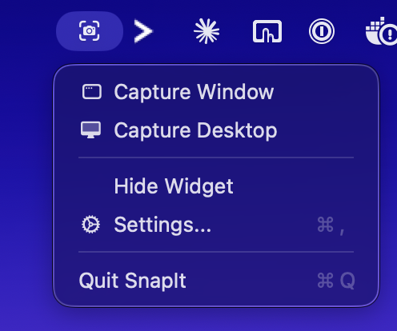
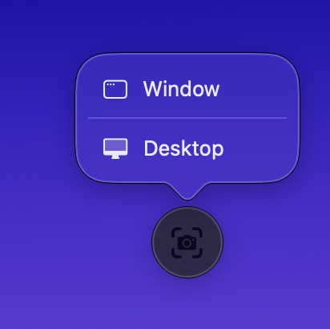

# SnapIt

A lightweight macOS menu bar app for capturing screenshots.

<p align="center">
  
  &nbsp;&nbsp;&nbsp;
  
</p>

## Features

- **Menu bar integration** — capture windows or your full desktop from the menu bar
- **Floating widget** — a draggable, always-on-top button for quick captures
- **Window shadow control** — include or exclude window shadows in captures
- **Custom save location** — choose where screenshots are saved
- **Adjustable widget opacity** — blend the widget into your workflow
- **Remembers position** — the widget stays where you put it across launches

## Requirements

- macOS 14.0 (Sonoma) or later
- Swift 5.10+

## Build & Install

```bash
# Build the release binary
make build

# Build and create the .app bundle
make bundle

# Build, bundle, and install to /Applications
make install

# Build, bundle, and open
make run
```

## Usage

SnapIt runs as a menu bar app — it won't appear in your Dock.

**Menu bar:** Click the camera icon in the menu bar to access capture options, toggle the floating widget, or open settings.

**Floating widget:** A small draggable button that floats above all windows. Click it to choose between window or desktop capture. Drag it anywhere on screen — it remembers its position.

**Settings** (⌘,):
- Toggle the floating widget on/off
- Adjust widget opacity
- Include/exclude window shadows in captures
- Choose your screenshot save folder

Screenshots are saved as `SnapIt-YYYY-MM-DD-HHmmss.png` in your chosen directory (defaults to Desktop).

## Permissions

macOS will prompt you to grant **Screen Recording** permission the first time you capture. Go to **System Settings → Privacy & Security → Screen Recording** and enable SnapIt.

## License

[MIT](LICENSE)
